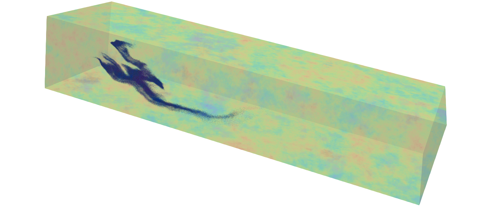

# modpath-rw
A Random Walk Particle Tracking Code for Solute Transport in Heterogeneous Aquifers



## Overview
MODPATH-RW is a Random Walk Particle Tracking (RWPT) model, implemented by extension of the particle tracking program [MODPATH-v7](https://github.com/MODFLOW-USGS/modpath-v7). The code employs discrete solute particles to solve the Advection Dispersion Equation (ADE), and inherits the parallel processing of particles from [MODPATH-OMP](https://github.com/upc-ghs/modpath-omp).

The program is naturally integrated with groundwater flow models obtained with MODFLOW-2005, MODFLOW-USG and [MODFLOW 6](https://github.com/MODFLOW-USGS/modflow6), for structured and rectangular unstructured grids.

## Build

### Get the code
Clone the repository

```
git clone https://github.com/upc-ghs/modpath-rw
```

Some external dependencies are stored in the ``src/lib`` folder. The necessary files are all explicitly included in the repository for convenience. 

- [``gpkde``](https://github.com/upc-ghs/gpkde.git): module for smoothed reconstruction of concentrations.

- [``finterp``](https://github.com/jacobwilliams/finterp.git): module for linear interpolation.

- [``rng_par_zig``](https://bitbucket.org/LadaF/elmm/src/master/src/rng_par_zig.f90): module for random number generation in parallel with the Ziggurat method. 


### Makefile
Makefiles are available at the folder `make`:

- `makefile-gfortran-pc`: for the `gfortran` compiler.
- `makefile-ifort-pc`: for the `ifort` compiler, verified for `ifort@2021.9.0`.
- `makefile-gfortran-mac`: for the `gfortran` compiler. 

By default, the compiled program is called ``mpathrw``. Compilation process will create a folder with temporary objects (``make/objtemp``). When integrating program updates and recompiling, it is advised to remove this folder to avoid inconsistencies. 

### Meson
The program can be built with the [meson](https://mesonbuild.com/) build system:

- Setup the configuration:

```
    meson setup builddir -Ddebug=false --prefix=$(pwd) --libdir=bin
``` 

- Compile: 

```
    meson install -C builddir
```

- Test:

```
    meson test --verbose --no-rebuild -C builddir
```

### Visual Studio
The folder `msvs` contains the project and solution files generated with Visual Studio 2022 on a Windows system.

### Windows binary
 An executable file and complementary `dll`'s providing the OpenMP library are available at the folder `wbin/`. Users can make easy use of these files at a system level by extending the `PATH` environment variable, adding their specific address to the `wbin/` folder (as [here](https://www.itprotoday.com/windows-server/how-can-i-add-new-folder-my-system-path) or [here](https://windowsloop.com/how-to-add-to-windows-path/)).

The necessary `dll`'s can also be installed from the Intel and Visual Studio redistributables (`x64`), respectively:

 - [Intel Fortran Compiler Runtime for Windows](https://www.intel.com/content/www/us/en/developer/articles/tool/compilers-redistributable-libraries-by-version.html) 
 - [Microsoft Visual C++ Redistributable](https://learn.microsoft.com/en-US/cpp/windows/latest-supported-vc-redist?view=msvc-170)


## Input files
Details about the configuration of input files are provided in the program [Documentation of Input-Output](doc/modpath-rw_IO_v100_.pdf). It is recommended to follow this document closely with the [Description of Model Input and Output of MODPATH-v7](doc/MODPATH_7_io.pdf).

Users familiarized with the `python` interface [FloPy](https://github.com/modflowpy/flopy) are encouraged to write input files for MODPATH-RW with the extension [flopyrw](https://github.com/upc-ghs/flopyrw). This package provides classes based on the interface for [mp7](https://github.com/modflowpy/flopy/tree/develop/flopy/modpath), which have been adapted to the specific requirements of MODPATH-RW, plus new classes for the new model packages. The extension is consistent with the program documentation and example configuration routines and test cases can be found on the project page.


## Command line interface 
A command line interface provides some simple instructions and shortcuts for managing program execution. Asking for help (``mpathrw -h``) displays the following message

```
MODPATH-RW version *.*.*               
Program compiled MMM DD YYYY HH:MM:SS with ******** compiler (ver. *******)       

A Random Walk Particle Tracking code for solute transport in heterogeneous aquifers

usage:

  mpathrw [options] simfile

options:
                                                                                 
  -h         --help                Show this message                             
  -i         --init                Initialize simulation without running         
  -l  <str>  --logname    <str>    Write program logs to <str>                   
  -nl        --nolog               Do not write log file                         
  -np <int>  --nprocs     <int>    Run with <int> processes                      
  -p         --parallel            Run in parallel                               
  -ts <int>  --tsoutput   <int>    Selects timeseries output <int>               
  -s         --shortlog            Simplified logs                               
  -v         --version             Show program version                          
                                                                                 
For bug reports and updates, follow:                                             
  https://github.com/upc-ghs/modpath-rw  
```
Note: if the OpenMP library is not found by compilers, the program will be generated without parallel compatibility, without the input parameters `nprocs`, `parallel` and `tsoutput`. If these are listed on the program help message (as above), the compilation with parallel compatibility was successful. 

#### Some relevant CLI arguments

`--init`: initialize the program packages and stop execution before displacing particles. Useful to monitor the initialization workflow and reports written to the `mplst` file.

`--nprocs`: run in parallel with the given number of processes (`omp_set_num_threads(nprocs)`).
 
`--parallel`: shorthand for running in parallel with the maximum number of processors (`omp_get_num_procs()`).

Note: if neither ``--parallel`` nor ``--nprocs`` are given, the program will by default employ ``omp_get_max_threads()``, whose value can be controlled with the environment variable `OMP_NUM_THREADS`.


`--tsoutput`: controls the output protocol for timeseries runs while running in parallel

- 1: is the default format, output is performed into a single output unit with the OpenMP thread exclusive clause (critical). Only difference versus a serial run is that the output file contains non-sorted particle indexes.
- 2: timeseries records are written into thread specific binary units and then consolidated into a single file after each timeseries output time. Timeseries file generated with this format does not contains a file header.
- 3: timeseries records are written into thread specific output units. Timeseries file header is written only to the output unit of the first thread ``1_example.timeseries``. Initial particle positions are also written to the file of the first thread.

## Contributing
Follow the [contribution guidelines](readme/CONTRIBUTING.md) for this project.

## License
MIT License

## References
[Pérez-Illanes R., Fernàndez-Garcia, D., 2023, Multiprocessing for the Particle Tracking Model MODPATH, Groundwater 61, no. 5: 733–742, doi:10.1111/gwat.13279](https://doi.org/10.1111/gwat.13279)

[Pérez-Illanes R., Fernàndez-Garcia, D., 2024, MODPATH-RW: A Random Walk Particle Tracking Code for Solute Transport in Heterogeneous Aquifers, Groundwater, doi:10.1111/gwat.13390](https://doi.org/10.1111/gwat.13390)


## Resources
* [MODPATH](https://www.usgs.gov/software/modpath-particle-tracking-model-modflow)
* [MODPATH-v7](https://github.com/MODFLOW-USGS/modpath-v7)
* [MODPATH-OMP](https://github.com/upc-ghs/modpath-omp)
* [GPKDE](https://github.com/upc-ghs/gpkde)
* [flopy](https://github.com/modflowpy/flopy)
* [flopyrw](https://github.com/upc-ghs/flopyrw)
* [gfortran](https://gcc.gnu.org/wiki/GFortran)
* [Intel oneApi HPC toolkit](https://www.intel.com/content/www/us/en/developer/tools/oneapi/hpc-toolkit.html)
* [OpenMP](https://www.openmp.org/)
* [MIT License](https://mit-license.org/)
